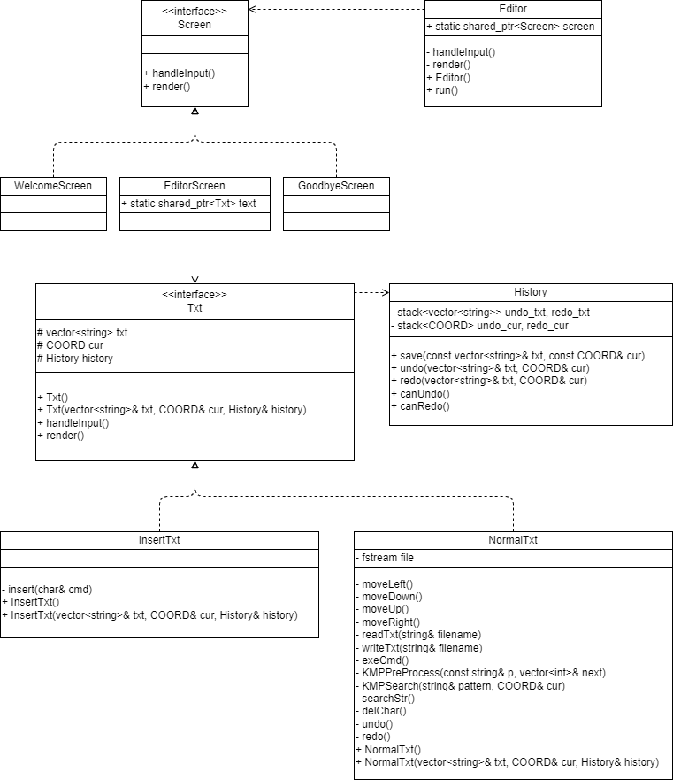

# simple-vim

> 20307130136林琰钧

## 1. 介绍

- 复旦大学2021秋数据结构pj
- 基于c++，设计一个简易vim编辑器
  - 该vim编辑器有三个界面，分别是欢迎界面、操作界面与结束界面
  - 在操作界面中有两种模式，分别是普通模式与操作模式
  - 可以通过键盘输入控制这两种模式的操作以及模式之间与界面之间的转换
  - 具体而言，普通模式具有移动光标、删除、撤销、重做、查找、打开文件、保存文件、切换到插入模式、退出等功能；插入模式有移动光标、插入、切换到普通模式等功能

## 2. 环境

- Windows系统
- cmd终端
- C++14

## 3. 项目结构

``` plain
|_assets .txt等文件存放文件夹
CursorOp.cpp 光标操作工具函数
CursorOp.h
Editor.cpp 编辑器
Editor.h
EditorScreen.cpp 编辑屏幕
EditorScreen.h
fdvim.cpp 主程序
fdvim.exe 可执行程序
GoodbyeScreen.cpp 结束屏幕
GoodbyeScreen.h
History.cpp 历史记录
History.h
InsertTxt.cpp 插入文字
InsertTxt.h
Makefile 编译项目所需的文件
NormalTxt.cpp 普通文字
NormalTxt.h
README.md 本文档
Screen.h 屏幕虚基类
Txt.cpp 文字虚基类
Txt.h
WelcomeScreen.cpp 欢迎屏幕
WelcomeScreen.h
```

## 4. 设计



- 数据结构设计
  - 文本以行为单位，每行储存在string里，所有string储存在vector中
  - 撤销与重做通过两个stack实现，每进行一次非重做非撤销操作都将历史push进撤销的stack中，每进行一次撤销操作都pop撤销的stack并push进重做的stack，每进行一次重做操作都pop重做的stack并push进撤销的stack
  - 文件流数据结构、光标操作、控制台窗口需要的句柄、智能指针等结构可以通过标准库直接调用
- 框架设计
  - 首先构建出了三个基本的界面
    - 考虑到有三种操作界面，这三个界面具有相似性，都有显示界面与处理输入的功能，因此先设计一个`Screen`父类，三种界面作为`Screen`的子类继承，记为`WelcomeScreen`，`EditorScreen`以及`GoodbyeScreen`。它们由于具有处理输入与显示界面的共同功能，因此将`Screen`作为虚基类，带有`handleInput`与`render`两个虚函数，其三个子类重写这两个操作。
    - 考虑通过多态实现上述三种界面的调用，因此通过智能指针来实现。由此，设计`Editor`类，储存一个调用窗口的智能指针`static std::shared_ptr<Screen> screen`，并且具有运行程序`run`，控制输入`handleInput`，显示界面`render`三个功能。其中，`run`是一个死循环，不断调用`render`以及`handleInput`，`render`与`handleInput`分别调用`screen`的`render`与`handleInput`，实现多态。
  - 然后构建`EditorScreen`的两种模式的操作
    - 首先建立历史操作的储存类`History`，其中带有撤销与重做的文本与光标位置的`stack`，共4个，为`stack<vector<string>> undo_txt, redo_txt;`以及`stack<COORD> undo_cur, redo_cur`。类中，有保留历史操作的`save`函数，以及撤销、重做操作的`undo`、`redo`函数，以及是否能进行撤销、重做操作的判断函数`canUndo`、`canRedo`。
    - 考虑到这两种模式的操作具有相似性，比如都有文字的储存显示、历史记录的保留等，因此先设计一个`Txt`父类，两种模式作为`Txt`的子类继承，记为`NormalTxt`以及`InsertTxt`。它们由于具有处理输入与显示界面的共同功能，因此将`Txt`作为虚基类，带有`handleInput`与`render`两个虚函数，其两个子类重写这两个操作。由于两个子类都有文本显示、光标位置、历史记录，因此在`Txt`类中储存`vector<string> txt`、`COORD cur`、`History history`三个数据。在`NormalTxt`类中，由于具有读写文件的操作，因此加入文件流数据`fstream file`；在`InsertTxt`类中，没有多余的数据。
    - 考虑通过多态实现上述两种模式的调用，因此通过智能指针来实现。由此，在`EditorScreen`中储存一个调用不同模式的智能指针`static std::shared_ptr<Txt> text`，实现多态。
  - 综上，便成功地封装出了若干类，类之间有继承关系，也有依赖关系，灵活多变、可读性强。其结果是，`main`函数中只需要实例化`Editor`类，并且调用`run`函数，就可以运行这个Vim编辑器，简洁明了。

## 5. 运行

- 编译与启动程序

  - 在主文件夹打开cmd命令行，输入`make`，即可生成`fdvim.exe`，双击启动程序
    - 注：`make clean`可以清除.o文件
  - 注意
    - 不支持程序窗口大小的调整
    - 不支持文本的换行和换页
    - 所有fdvim所编辑的文件都存放在`assets`文件夹内

- 初始界面

  - 显示欢迎文字
  - 按任意键，进入默认模式Normal模式

- Normal模式

  - 窗口左下角有`<Normal>`提示符，该行是命令与提示操作区，上方是文本内容区
  - 命令
    - `:open filename`：读取文本文件filename并显示，若不存在则新建，若已存在则直接打开；filename为`assets`文件夹下的文件名，例如`1.txt`
    - `:w filename`：保存文本到文件filename，若不存在则新建，若已存在则直接覆盖
    - `:q`：退出编辑器
    - `x`：删除光标处字符
    - `u`：撤销上次操作
    - `r`：重做上次操作
    - `/pattern`：从光标处开始全字匹配pattern字符串
    - `h`, `j`, `k`, `l`：分别表示光标向左下上右移动
    - `i`：进入Insert模式

- Insert模式

  - 窗口左下角有`<Insert>`提示符，该行是提示操作区，上方是文本内容区
  - 命令
    - `esc`：进入Normal模式
    - 其他输入均会在光标处将内容添加入文本
